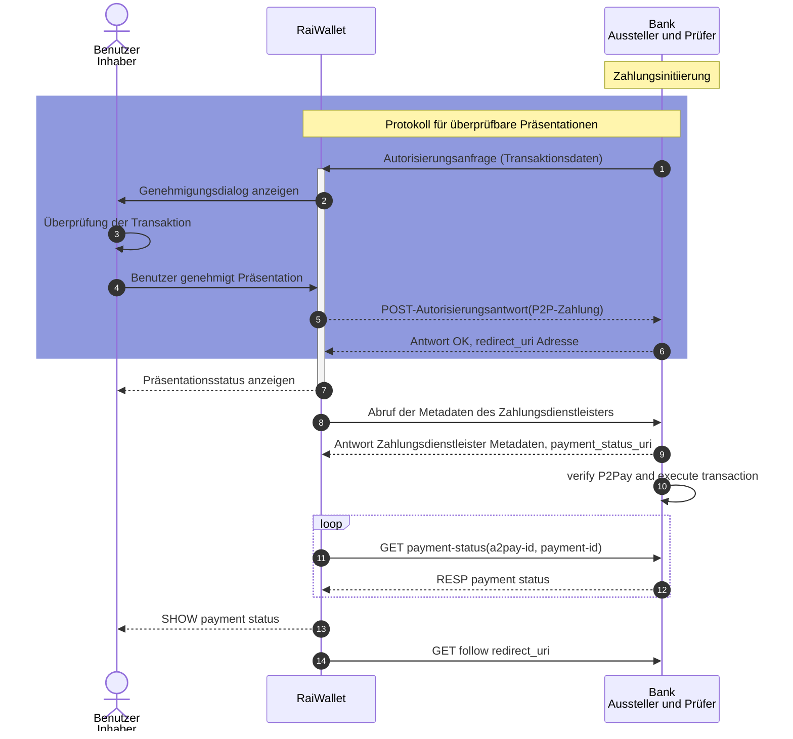

```mermaid

sequenceDiagram
    autonumber
    actor user as Benutzer<br/>Inhaber
    participant wallet as RaiWallet 
    participant psp as Bank<br/>Aussteller und Prüfer

    Note over psp: Zahlungsinitiierung
    rect rgb(143, 153, 222)
    note over wallet, psp: Protokoll für überprüfbare Präsentationen
    psp ->> wallet: Autorisierungsanfrage (Transaktionsdaten)
    activate wallet
    wallet ->> user: Genehmigungsdialog anzeigen
    user ->> user: Überprüfung der Transaktion
    user ->> wallet: Benutzer genehmigt Präsentation
    wallet -->> psp: POST-Autorisierungsantwort(P2P-Zahlung)
    psp -->> wallet: Antwort OK, redirect_uri Adresse
    end
    wallet -->> user: Präsentationsstatus anzeigen
    deactivate wallet
    wallet ->> psp: Abruf der Metadaten des Zahlungsdienstleisters
    psp -->> wallet: Antwort Zahlungsdienstleister Metadaten, payment_status_uri
    psp ->> psp: verify P2Pay and execute transaction
    loop
    wallet ->> psp: GET payment-status(a2pay-id, payment-id)

    psp -->> wallet: RESP payment status 
    end
    wallet -->> user: SHOW payment status
    wallet ->> psp: GET follow redirect_uri

```
