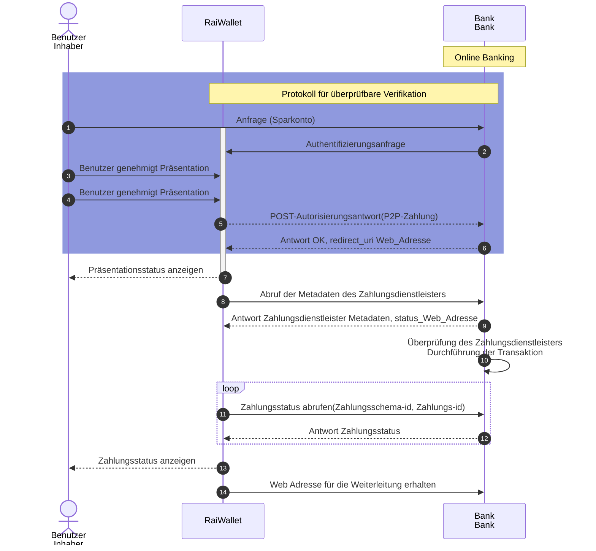

```mermaid

sequenceDiagram
    autonumber
    actor user as Benutzer<br/>Inhaber
    participant wallet as RaiWallet 
    participant psp as Bank<br/>Bank

    Note over psp: Online Banking
    rect rgb(143, 153, 222)
    note over wallet, psp: Protokoll für überprüfbare Verifikation
    user ->> psp: Anfrage (Sparkonto)
    activate wallet
    psp ->> wallet: Authentifizierungsanfrage
    user ->> wallet: Benutzer genehmigt Präsentation
    user ->> wallet: Benutzer genehmigt Präsentation
    wallet -->> psp: POST-Autorisierungsantwort(P2P-Zahlung)
    psp -->> wallet: Antwort OK, redirect_uri Web_Adresse
    end
    wallet -->> user: Präsentationsstatus anzeigen
    deactivate wallet
    wallet ->> psp: Abruf der Metadaten des Zahlungsdienstleisters
    psp -->> wallet: Antwort Zahlungsdienstleister Metadaten, status_Web_Adresse
    psp ->> psp: Überprüfung des Zahlungsdienstleisters <br/> Durchführung der Transaktion
    loop
    wallet ->> psp: Zahlungsstatus abrufen(Zahlungsschema-id, Zahlungs-id)

    psp -->> wallet: Antwort Zahlungsstatus 
    end
    wallet -->> user: Zahlungsstatus anzeigen
    wallet ->> psp: Web Adresse für die Weiterleitung erhalten

```
