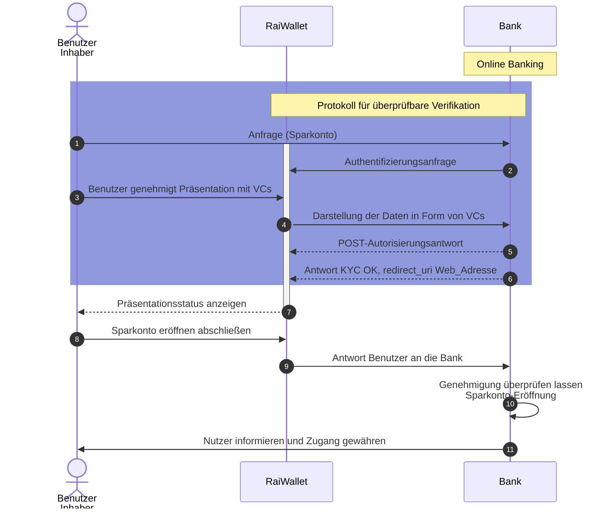

```mermaid

sequenceDiagram
    autonumber
    actor user as Benutzer<br/>Inhaber
    participant wallet as RaiWallet 
    participant psp as Bank

    Note over psp: Online Banking
    rect rgb(143, 153, 222)
    note over wallet, psp: Protokoll für überprüfbare Verifikation
    user ->> psp: Anfrage (Sparkonto)
    activate wallet
    psp ->> wallet: Authentifizierungsanfrage
    user ->> wallet: Benutzer genehmigt Präsentation mit VCs
    wallet ->> psp: Darstellung der Daten in Form von VCs
    psp -->> wallet: POST-Autorisierungsantwort
    psp -->> wallet: Antwort KYC OK, redirect_uri Web_Adresse
    end
    wallet -->> user: Präsentationsstatus anzeigen
    deactivate wallet
    user ->> wallet: Sparkonto eröffnen abschließen
    wallet ->> psp: Antwort Benutzer an die Bank
    psp ->> psp: Genehmigung überprüfen lassen <br/> Sparkonto-Eröffnung
    psp ->> user: Nutzer informieren und Zugang gewähren
    

```
